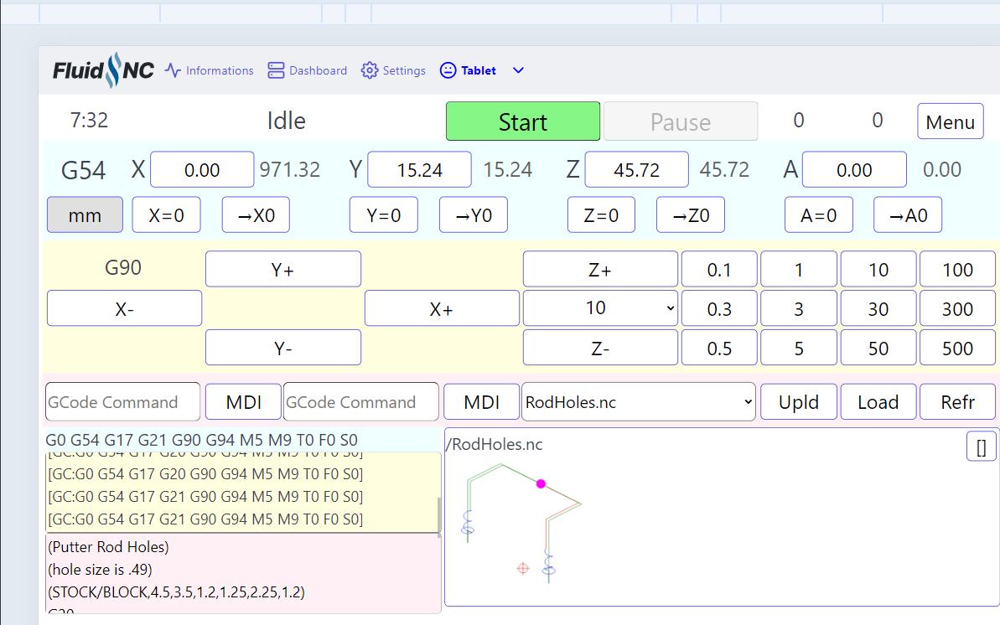
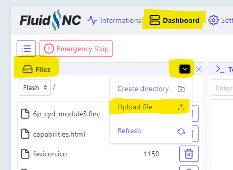
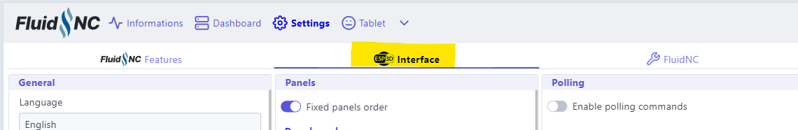
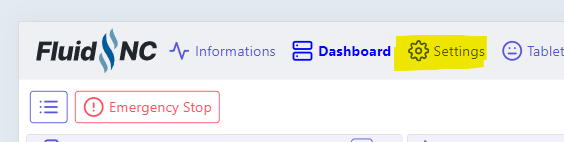
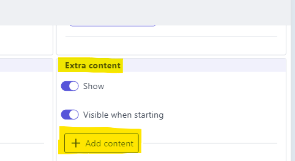
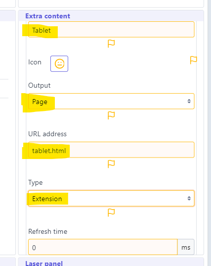
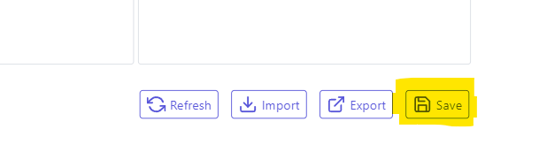
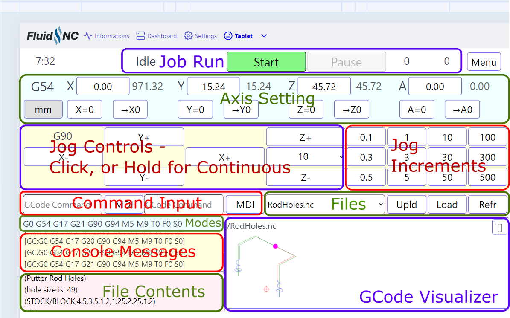
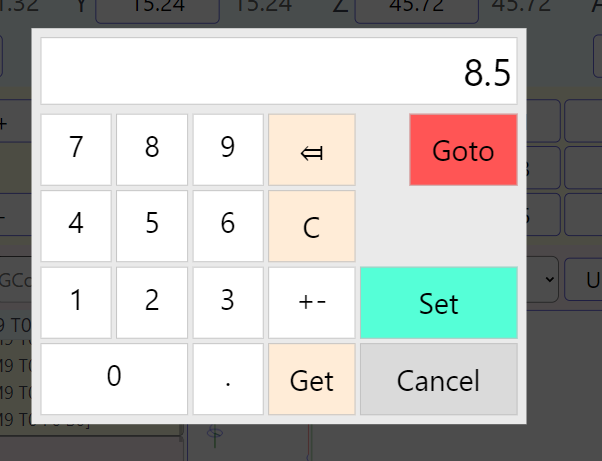
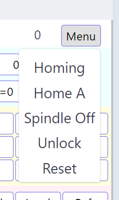

# WebUI-tablet-extension
Plugin for ESP3D WebUI implementing a user interface optimized for tablets

> [!IMPORTANT]
> Software like this takes a lot of time to develop, support and maintain.  If you use it, please consider contributing to the developers.  Since this code depends on a larger project, I ask that donations go to the creator of that other project 
(https://github.com/luc-github/ESP3D-WEBUI?tab=readme-ov-file#become-a-sponsor-or-a-supporter)

## Scope

This is an addition to [ESP32-WEBUI](https://github.com/luc-github/ESP3D-WEBUI.git) version 3 that presents an additional user interface for CNC use.  The new UI works well with
tablet computers and other touchscreens of similar size.  It is especially useful in a production environment where you want quick access to a small number of
frequently-used functions.

* All of the main controls are on a single screen, in fixed locations.  Scrolling to find a control is unnecessary.
* The control buttons are large, easily touched with a finger, instead of needing a mouse to point precisely at a small icon.
* The text is large for easy visibility from far away.
* Color coding makes it easier to see the run state at a glance
* A GCode visualizer and file content display helps with job setup, letting you confirm that the job is the one you want, with the tool in the right position.

It is intended for use with CNC controllers that are compatible with GRBL.  Most of the testing is done with [FluidNC](https://github.com/bdring/FluidNC). It lacks many capabilities that are commonly needed for 3D printing.

## Installation

You need a system that is already running ESP3D-WEBUI version 3.

1. Go to the [Releases page](https://github.com/MitchBradley/WebUI-tablet-extension/releases) and download the **tablet.html.gz** file from the latest release.

2. Upload tablet.html.gz to the Flash filesystem

4. In WebUI, click on the Interface tab, then click on Settings

5. Scroll down to find the **Extra content** panel then click on **Add Content**

6. Fill out the form as follows

7. Scroll all the way down to the bottom of the page and hit Save

8. Now the top tab bar should have an **Extra pages** dropdown with a **Tablet** entry.  Click that to go to the Tablet UI

## Usage

Most of the controls are self explanatory.  The screen is divided into functional areas:

Clicking on a DRO (axis position) brings up a numeric keypad where you can enter and number and then either go to that coordinate or set the axis position to it.

A few auxiliary functions are behind the menu:

To run a job, select the file from the file selector dropdown menu.  Its GCode will show in the lower left box and the toolpath will be displayed in the lower right box.  You can inspect the tool position relative to the toolpath to ensure that your setup is correct before hitting the (now green) Start button to run the program.  Clicking in the visualizer will cycle between several viewpoints, some with machine envelope boundaries shown.

When a job is running, the visualizer will expand, hiding the controls that are not usable during Run state.  Clicking on the [] button will shrink or expand the visualizer.

The two text entry boxes left of "MDI" buttons each let you enter a line of text to send to the controller.  There are two of them which is often enough for simple manual jobs like going back and forth.

## History

The first version of this user interface was released as [cncjs-shopfloor-tablet](https://github.com/MitchBradley/cncjs-shopfloor-tablet.git) as an extension to [cncjs](https://github.com/cncjs/cncjs.git).  Later it was ported to ESP3D-WEBUI version 2, [in this fork](https://github.com/MitchBradley/ESP3D-WEBUI.git/tree/#revamp).  That second version was mainly used with FluidNC.

This version works with ESP3D-WEBUI version 3, using its "Extra Content" extension mechanism.  That mechanism makes it possible to maintain and deploy this code independently of the main ESP3D-WEBUI tree.  The earlier version had to be in the same tree, compiled together with ESP3D-WEBUI into one index.html.gz file.

## Development

This program consists of two source files src/tablet.js and src/tablet.css .  The shell script minify.js uses an external cloud-based Javascript minifier service to reduce their size, and then combines them into a single compressed file named build/tablet.html.gz, suitable for use as an ESP3D-WEBUI extension.

That file can be uploaded to the Flash filesystem on an ESP3D-WEBUI system and then used via ESP#d-WEBUI's Extra Content mechanism.
